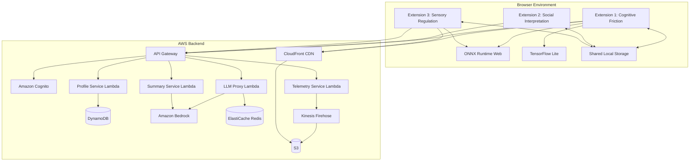

# Design Document: Adaptive Autism Support System

## Overview

The Adaptive Autism Support System is a privacy-first, continuously learning platform consisting of three Chrome extensions backed by AWS serverless infrastructure. The system uses behavioral modeling, on-device machine learning, and selective cloud AI to create personalized digital experiences for autistic users.

### Core Design Principles

1. **Privacy-First Architecture**: Most inference runs on-device; cloud AI invoked only for heavy semantic reasoning
2. **Continuous Learning**: System treats initial profiles as hypotheses, continuously refining through user interaction
3. **Probabilistic Decision-Making**: All interventions based on probability estimates with transparency and reversibility
4. **Proportional Response**: Intervention intensity scales with detected severity
5. **User Agency**: All adaptations are reversible and explainable
6. **Consent-Driven**: Explicit user permission required for all data collection

### System Architecture




## Architecture

### Extension 1: Learning Cognitive Friction & Confusion

**Purpose**: Detect and adapt to cognitive overload through behavioral signal analysis and on-device ML inference.

**Components**:

1. **Behavioral Signal Capture Module**
   - Cursor tracking: Captures x/y coordinates at 60Hz using `mousemove` events
   - Hesitation detection: Identifies pauses >2s using velocity threshold
   - Scroll analysis: Tracks `scroll` events with velocity and direction computation
   - Navigation monitoring: Observes `popstate` and `hashchange` events
   - Decision latency: Measures time between hover and click events

2. **Feature Engineering Module**
   - Temporal feature extraction:
     - Hesitation Index = (total_pause_time / total_interaction_time)
     - Navigation Instability = (back_forward_count / page_view_count)
     - Decision Latency = mean(hover_to_click_times)
     - Scroll Oscillation = variance(scroll_direction_changes)
     - Cursor Velocity Variance = std_dev(cursor_velocities)
   - Rolling window: 30-second sliding window for temporal patterns
   - Feature normalization: Z-score normalization using running statistics

3. **On-Device Inference Engine**
   - Runtime: ONNX Runtime Web (primary) or TensorFlow Lite (fallback)
   - Model architecture: Lightweight LSTM (2 layers, 64 hidden units) for temporal patterns
   - Input: 30-second window of normalized temporal features (5 features × 30 samples)
   - Output: Confusion probability [0.0-1.0], Cognitive load [0.0-1.0]
   - Inference latency target: <100ms
   - Model size: <5MB for fast loading

4. **Personal Cognitive Adaptation Model**
   - Learning algorithm: Contextual multi-armed bandit with Thompson sampling
   - State space: (confusion_prob, cognitive_load, page_complexity, time_of_day)
   - Action space: {reduce_clutter, stabilize_layout, simplify_text, highlight_actions, no_intervention}
   - Reward signal: User response (task_completion=+1, reversal=-1, continued_engagement=+0.5)
   - Update frequency: After each intervention with observed outcome
   - Exploration rate: ε-greedy with ε=0.1 (10% random exploration)

5. **UI Adaptation Engine**
   - Clutter reduction: CSS injection to hide elements with low interaction probability
   - Layout stabilization: Disable CSS animations, fix positions, pause auto-play
   - Text simplification: Replace complex phrases using local dictionary (no cloud calls)
   - Action highlighting: Add visual emphasis (border, shadow, color) to primary buttons
   - Proportional scaling: Intervention intensity = min(1.0, detected_severity × user_sensitivity)

6. **Model Update Manager**
   - Checks S3 manifest every 24 hours for new model versions
   - Downloads weights via CloudFront with integrity verification (SHA-256)
   - Loads new model in background, swaps atomically
   - Maintains fallback to previous version on load failure

**Data Flow**:
```
User Interaction → Signal Capture → Feature Engineering → On-Device Inference → 
Adaptation Decision → UI Intervention → User Response → Model Learning → 
Periodic Upload (anonymized) → Backend Model Training → Updated Weights → Download
```


### Extension 2: Real-Time Social & Communication Interpretation

**Purpose**: Provide real-time interpretation of social communication in video meetings through hybrid on-device and cloud AI.

**Components**:

1. **Caption Detection Module**
   - DOM observation: MutationObserver watching for caption element changes
   - Platform adapters:
     - Google Meet: `.a4cQT` (caption container)
     - Zoom: `.caption-line-item` 
     - Microsoft Teams: `.closed-captions-container`
     - Generic: `[role="log"]`, `[aria-live="polite"]`
   - Adaptive selector: Falls back through selector list on detection failure
   - Text extraction: innerText with whitespace normalization
   - Utterance segmentation: Split on sentence boundaries, merge fragments

2. **Conversational Context Manager**
   - Sliding window: Last 10 utterances with timestamps
   - Speaker tracking: Extract speaker names from caption metadata
   - Turn-taking detection: Identify speaker changes and pauses
   - Topic segmentation: Detect topic shifts using keyword similarity
   - Context serialization: Format for LLM consumption (speaker: text format)

3. **Hybrid Inference Pipeline**
   - **Rule-Based Classifier** (on-device, <10ms):
     - Question detection: Regex for question marks, WH-words, auxiliary inversion
     - Request detection: Modal verbs (could, would, can) + you/we
     - Common idioms: Dictionary lookup for 500 common expressions
     - Sarcasm indicators: "yeah right", "sure", excessive punctuation
   - **Cloud LLM Fallback** (via Backend, ~500ms):
     - Triggered when: Rule confidence <0.7 or unknown pattern
     - Prompt template: "Analyze this utterance in context: [context]. Utterance: [text]. Provide: intent, literal meaning, implied meaning, tone."
     - Model: Claude 3 Haiku via Bedrock (fast, cost-effective)
     - Response parsing: Extract JSON fields from LLM response

4. **Semantic Analysis Engine**
   - Intent classification: {question, request, statement, joke, sarcasm, agreement, disagreement}
   - Indirect phrasing detection: Compare literal vs. contextual meaning
   - Figurative expression handling: Idiom database + LLM interpretation
   - Tone annotation: {neutral, urgent, humorous, sarcastic, concerned}
   - Confidence scoring: Combine rule-based and LLM confidence scores

5. **Optional Visual Analysis Module**
   - Face detection: MediaPipe Face Landmarker running at 5fps
   - Expression estimation: Map facial landmarks to expression categories
   - Categories: {neutral, happy, concerned, confused, frustrated, surprised}
   - On-device processing: All computation in browser, no frame upload
   - Privacy controls: Explicit permission, visual indicator when active, instant disable

6. **Overlay Rendering Engine**
   - Overlay types:
     - Clarification bubble: Shows plain-language explanation of indirect phrasing
     - Decision highlight: Yellow background on decision-related text
     - Speaking prompt: Green indicator suggesting appropriate speaking window
     - Expression label: Small badge showing detected expression
   - Positioning: Absolute positioning near caption area, collision avoidance
   - Auto-dismiss: 5-second timeout or manual close
   - Queue management: Max 3 simultaneous overlays, queue additional
   - Styling: Minimal design, customizable opacity/size

7. **Meeting Summary Generator**
   - Trigger: Meeting end detection (DOM changes) or manual user trigger
   - Preprocessing: Concatenate all utterances with speaker labels
   - Chunking: Split into 4000-token chunks if exceeds limit
   - LLM prompt: "Extract from this meeting: 1) Decisions made, 2) Tasks assigned with owners, 3) Deadlines mentioned, 4) Action items. Format as JSON."
   - Model: Claude 3 Sonnet via Bedrock (better reasoning for extraction)
   - Post-processing: Parse JSON, validate structure, format for display
   - Storage: IndexedDB with meeting metadata (date, platform, duration)
   - Export: Markdown and plain text formats

**Data Flow**:
```
Caption DOM Change → Text Extraction → Context Window Update → 
Rule-Based Analysis → [If needed] Cloud LLM Call → Semantic Interpretation → 
Overlay Rendering → User Interaction → Meeting End → Summary Generation → 
Local Storage
```


### Extension 3: Sensory Stress & Overload Regulation

**Purpose**: Detect and mitigate sensory overload from visual and audio stimuli through real-time analysis and proportional interventions.

**Components**:

1. **Visual Feature Extraction Module**
   - Frame sampling: Canvas API to capture video frames at 10fps
   - Brightness volatility: 
     - Compute mean luminance per frame: L = 0.299R + 0.587G + 0.114B
     - Frame-to-frame difference: ΔL = |L(t) - L(t-1)|
     - Volatility score: mean(ΔL) over 1-second window
   - Flash frequency:
     - Count brightness changes >10% within 1-second window
     - Weighted by change magnitude
   - Contrast oscillation:
     - Compute Michelson contrast: C = (L_max - L_min) / (L_max + L_min)
     - Track variance of C over 2-second window
   - Motion turbulence:
     - Optical flow using Lucas-Kanade method (sparse)
     - Magnitude: sqrt(vx² + vy²)
     - Direction variance: circular variance of flow angles
     - Turbulence score: magnitude × direction_variance

2. **Audio Feature Extraction Module**
   - Audio capture: Web Audio API with AnalyserNode
   - Amplitude envelope:
     - RMS calculation over 100ms windows
     - Envelope = sqrt(mean(samples²))
   - Peak burst detection:
     - Identify samples exceeding 2× rolling average
     - Count bursts per second
   - Spectral harshness:
     - FFT analysis (2048-point)
     - High-frequency energy: sum(magnitude[4kHz:8kHz]) / sum(magnitude[total])
     - Harshness score: weighted by frequency band discomfort curve
   - Dynamic spikes:
     - Loudness in LUFS (ITU-R BS.1770)
     - Track sudden changes >6 LUFS within 1 second

3. **On-Device Sensory Stress Model**
   - Runtime: ONNX Runtime Web
   - Model architecture: Temporal CNN (3 conv layers) + LSTM (1 layer, 32 units)
   - Input: Multi-modal feature vector (8 visual + 4 audio features) × 10-second window
   - Output: Overload probability [0.0-1.0], Trajectory prediction [10 future timesteps]
   - Personalization: Model incorporates user-specific thresholds from profile
   - Inference latency: <100ms
   - Model size: <3MB

4. **Proportional Intervention Engine**
   - **Dimming**:
     - Trigger: overload_prob > 0.6
     - Intensity: 10% + (30% × overload_prob)
     - Implementation: CSS filter brightness() on video element
   - **Contrast Softening**:
     - Trigger: contrast_oscillation > user_threshold
     - Intensity: Reduce contrast by (oscillation_severity × 0.3)
     - Implementation: CSS filter contrast()
   - **Flash Damping**:
     - Trigger: flash_frequency > 3 per second
     - Method: Temporal smoothing using exponential moving average
     - Implementation: Canvas-based frame interpolation
   - **Motion Smoothing**:
     - Trigger: motion_turbulence > user_threshold
     - Method: Reduce effective frame rate or apply motion blur
     - Implementation: Skip frames or CSS filter blur()
   - **Audio Compression**:
     - Trigger: dynamic_spikes > user_threshold
     - Method: DynamicsCompressorNode with adaptive ratio
     - Parameters: threshold=-20dB, ratio=4:1, attack=5ms, release=50ms

5. **Continuous Learning Module**
   - User response signals:
     - Continued viewing: Positive signal (reward=+0.5)
     - Manual adjustment: Strong signal (reward=±1.0 based on direction)
     - Content abandonment: Negative signal (reward=-1.0)
     - Explicit feedback: User rating (reward=-1.0 to +1.0)
   - Sensitivity curve update:
     - Bayesian updating of threshold distributions
     - Per-feature thresholds: P(threshold | observations)
     - Convergence: After 50+ interventions per feature type
   - Batch upload: Anonymized (feature_type, threshold_adjustment, outcome) tuples
   - Backend aggregation: Cluster users by sensitivity profiles, update model weights

6. **Video Player Integration**
   - Supported players:
     - HTML5 video: Direct element access
     - YouTube: IFrame API + DOM manipulation
     - Vimeo: Player API
     - Netflix: DOM-based (best effort)
   - Intervention injection: CSS filters, canvas overlay, or Web Audio routing
   - Fallback: If player blocks intervention, show warning overlay

**Data Flow**:
```
Video/Audio Playback → Feature Extraction (parallel) → On-Device Inference → 
Overload Prediction → Intervention Decision → Apply Proportional Intervention → 
User Response Observation → Sensitivity Curve Update → Periodic Upload → 
Backend Aggregation → Updated Model Weights → Download
```


### AWS Backend Architecture

**Design Philosophy**: Serverless, auto-scaling, pay-per-use architecture optimized for variable load and global distribution.

**Components**:

1. **Amazon Cognito - Authentication Service**
   - User pools: Manage user registration, authentication, password reset
   - Identity providers: Support Google, Microsoft, Apple OAuth
   - JWT tokens: Access tokens (1 hour TTL), refresh tokens (30 days TTL)
   - Token scopes: `profile:read`, `profile:write`, `llm:invoke`, `telemetry:write`
   - MFA support: Optional TOTP-based multi-factor authentication
   - Custom attributes: User sensitivity profiles, feature flags

2. **Amazon API Gateway - Request Router**
   - REST API with regional endpoints
   - Authorizer: Cognito JWT validation
   - Rate limiting: 100 requests/minute per user (token bucket algorithm)
   - Request validation: JSON schema validation on request bodies
   - CORS configuration: Allow extension origins only
   - Endpoints:
     - `GET /profile` - Retrieve user profile
     - `PUT /profile` - Update user profile
     - `POST /llm/interpret` - Request utterance interpretation
     - `POST /llm/summarize` - Generate meeting summary
     - `POST /telemetry` - Upload anonymized telemetry
     - `GET /config` - Fetch configuration bundle
     - `GET /models/manifest` - Get latest model versions

3. **Profile Service Lambda**
   - Runtime: Node.js 20.x
   - Memory: 512MB
   - Timeout: 10 seconds
   - Operations:
     - `getProfile(userId)`: Query DynamoDB, return profile JSON
     - `updateProfile(userId, updates)`: Validate schema, conditional write to DynamoDB
     - `createProfile(userId, initialSettings)`: Initialize new user profile
   - DynamoDB schema:
     ```json
     {
       "userId": "string (partition key)",
       "version": "number (for optimistic locking)",
       "cognitiveThresholds": {
         "confusionTrigger": 0.7,
         "cognitiveLoadTrigger": 0.8
       },
       "sensoryThresholds": {
         "brightnessVolatility": 0.15,
         "flashFrequency": 3.0,
         "motionTurbulence": 0.6,
         "audioHarshness": 0.5
       },
       "preferences": {
         "enableClutterReduction": true,
         "enableTextSimplification": true,
         "enableVisualAnalysis": false,
         "overlayOpacity": 0.9
       },
       "featureFlags": {
         "betaFeatures": false,
         "experimentGroup": "control"
       },
       "createdAt": "ISO8601 timestamp",
       "updatedAt": "ISO8601 timestamp"
     }
     ```

4. **LLM Proxy Lambda**
   - Runtime: Python 3.12
   - Memory: 1024MB
   - Timeout: 30 seconds
   - Operations:
     - `interpretUtterance(text, context)`: Analyze conversational intent
     - Cache strategy: Hash(text + context) as Redis key, 24-hour TTL
   - Bedrock integration:
     - Model: Claude 3 Haiku (`anthropic.claude-3-haiku-20240307-v1:0`)
     - Temperature: 0.3 (consistent interpretations)
     - Max tokens: 500
     - Prompt template:
       ```
       You are analyzing conversation for an autistic user who needs help understanding indirect communication.
       
       Context (previous utterances):
       {context}
       
       Current utterance: "{text}"
       
       Provide a JSON response with:
       - intent: question|request|statement|joke|sarcasm
       - literalMeaning: what the words literally say
       - impliedMeaning: what the speaker actually means
       - tone: neutral|urgent|humorous|sarcastic|concerned
       - confidence: 0.0-1.0
       ```
   - Error handling: Return fallback response on Bedrock failure

5. **Summary Service Lambda**
   - Runtime: Python 3.12
   - Memory: 2048MB (for large meeting transcripts)
   - Timeout: 60 seconds
   - Operations:
     - `generateSummary(utterances)`: Extract structured information
   - Chunking strategy: Split at 4000 tokens, process incrementally, merge results
   - Bedrock integration:
     - Model: Claude 3 Sonnet (`anthropic.claude-3-sonnet-20240229-v1:0`)
     - Temperature: 0.2 (factual extraction)
     - Max tokens: 2000
     - Prompt template:
       ```
       Extract key information from this meeting transcript for an autistic user who needs structured summaries.
       
       Transcript:
       {utterances}
       
       Provide a JSON response with:
       - decisions: [{text, timestamp, participants}]
       - tasks: [{description, assignee, deadline}]
       - deadlines: [{date, description}]
       - actionItems: [{description, owner}]
       - keyTopics: [string]
       ```

6. **Telemetry Service Lambda**
   - Runtime: Node.js 20.x
   - Memory: 256MB
   - Timeout: 5 seconds
   - Operations:
     - `ingestTelemetry(anonymizedData)`: Validate and stream to Kinesis
   - Validation: Ensure no PII, check data schema
   - Kinesis Firehose: Batch to S3 every 5 minutes or 5MB
   - S3 lifecycle: Delete after 90 days

7. **DynamoDB Tables**
   - **UserProfiles**:
     - Partition key: userId (string)
     - Capacity: On-demand (auto-scaling)
     - Encryption: AWS KMS
     - Point-in-time recovery: Enabled
   - **ConfigCache** (optional):
     - Partition key: configKey (string)
     - TTL: Enabled (auto-delete expired configs)

8. **S3 Buckets**
   - **model-weights-bucket**:
     - Versioning: Enabled
     - Encryption: SSE-S3
     - Objects: `cognitive-model-v{version}.onnx`, `sensory-model-v{version}.onnx`
     - Manifest: `manifest.json` with latest versions and checksums
   - **config-bucket**:
     - Objects: `thresholds.json`, `feature-flags.json`, `ui-templates.json`
   - **telemetry-bucket**:
     - Partitioning: `year=YYYY/month=MM/day=DD/hour=HH/`
     - Lifecycle: Delete after 90 days

9. **ElastiCache Redis Cluster**
   - Node type: cache.t4g.micro (for development), cache.r7g.large (for production)
   - Cluster mode: Disabled (single shard for simplicity)
   - Encryption: In-transit and at-rest
   - Use cases:
     - LLM response caching (key: hash, value: JSON, TTL: 24h)
     - Configuration caching (key: config_name, value: JSON, TTL: 5min)
     - Rate limiting counters (key: userId, value: count, TTL: 60s)

10. **CloudFront CDN**
    - Origins: S3 buckets (model-weights, config)
    - Cache behavior: Aggressive caching (24-hour TTL for models, 5-minute for configs)
    - Geographic distribution: Global edge locations
    - Signed URLs: For model downloads (1-hour expiration)
    - Compression: Gzip/Brotli for JSON configs

11. **Amazon Kinesis Firehose**
    - Source: Telemetry Service Lambda
    - Destination: S3 telemetry bucket
    - Buffering: 5 minutes or 5MB
    - Transformation: Optional Lambda for additional anonymization
    - Format: JSON lines (newline-delimited JSON)


## Components and Interfaces

### Extension Interfaces

**Extension 1: Cognitive Friction API**

```typescript
interface BehavioralSignal {
  timestamp: number;
  cursorVelocity: number;
  hesitationDuration: number;
  scrollVelocity: number;
  scrollDirectionChanges: number;
  navigationEvents: number;
  decisionLatency: number;
}

interface TemporalFeatures {
  hesitationIndex: number;      // [0.0-1.0]
  navigationInstability: number; // [0.0-1.0]
  decisionLatency: number;       // milliseconds
  scrollOscillation: number;     // variance
  cursorVelocityVariance: number;
}

interface CognitiveState {
  confusionProbability: number;  // [0.0-1.0]
  cognitiveLoad: number;         // [0.0-1.0]
  confidence: number;            // [0.0-1.0]
  timestamp: number;
}

interface AdaptationAction {
  type: 'reduce_clutter' | 'stabilize_layout' | 'simplify_text' | 'highlight_actions' | 'none';
  intensity: number;             // [0.0-1.0]
  targetElements: string[];      // CSS selectors
  reason: string;                // Explanation for user
}

interface UserResponse {
  action: 'task_completed' | 'intervention_reversed' | 'continued_engagement' | 'abandoned';
  timestamp: number;
  interventionId: string;
}

class CognitiveFrictionDetector {
  captureSignals(): BehavioralSignal;
  extractFeatures(signals: BehavioralSignal[]): TemporalFeatures;
  inferCognitiveState(features: TemporalFeatures): Promise<CognitiveState>;
  decideAdaptation(state: CognitiveState): AdaptationAction;
  applyAdaptation(action: AdaptationAction): void;
  observeResponse(): UserResponse;
  updateModel(response: UserResponse): void;
}
```

**Extension 2: Social Interpretation API**

```typescript
interface Utterance {
  text: string;
  speaker: string;
  timestamp: number;
  platform: 'google-meet' | 'zoom' | 'teams' | 'generic';
}

interface ConversationalContext {
  recentUtterances: Utterance[];  // Last 10
  currentSpeaker: string;
  topicKeywords: string[];
}

interface SemanticInterpretation {
  intent: 'question' | 'request' | 'statement' | 'joke' | 'sarcasm' | 'agreement' | 'disagreement';
  literalMeaning: string;
  impliedMeaning: string;
  tone: 'neutral' | 'urgent' | 'humorous' | 'sarcastic' | 'concerned';
  confidence: number;             // [0.0-1.0]
  requiresClarification: boolean;
}

interface FacialExpression {
  category: 'neutral' | 'happy' | 'concerned' | 'confused' | 'frustrated' | 'surprised';
  confidence: number;
  landmarks: number[][];          // MediaPipe landmarks (not stored)
}

interface Overlay {
  type: 'clarification' | 'decision_highlight' | 'speaking_prompt' | 'expression_label';
  content: string;
  position: {x: number, y: number};
  duration: number;               // milliseconds
  dismissible: boolean;
}

interface MeetingSummary {
  decisions: Array<{text: string, timestamp: number, participants: string[]}>;
  tasks: Array<{description: string, assignee: string, deadline?: string}>;
  deadlines: Array<{date: string, description: string}>;
  actionItems: Array<{description: string, owner: string}>;
  keyTopics: string[];
  meetingMetadata: {
    date: string,
    platform: string,
    duration: number,
    participantCount: number
  };
}

class SocialInterpretationEngine {
  detectCaptions(): Utterance | null;
  updateContext(utterance: Utterance): void;
  analyzeSemantics(utterance: Utterance, context: ConversationalContext): Promise<SemanticInterpretation>;
  analyzeFacialExpression(): Promise<FacialExpression | null>;
  renderOverlay(interpretation: SemanticInterpretation): void;
  generateSummary(utterances: Utterance[]): Promise<MeetingSummary>;
}
```

**Extension 3: Sensory Regulation API**

```typescript
interface VisualFeatures {
  brightnessVolatility: number;   // [0.0-1.0]
  flashFrequency: number;         // flashes per second
  contrastOscillation: number;    // variance
  motionTurbulence: number;       // [0.0-1.0]
  timestamp: number;
}

interface AudioFeatures {
  amplitudeEnvelope: number;      // RMS
  peakBurstCount: number;         // per second
  spectralHarshness: number;      // [0.0-1.0]
  dynamicSpikes: number;          // LUFS change rate
  timestamp: number;
}

interface SensoryStressState {
  overloadProbability: number;    // [0.0-1.0]
  trajectory: number[];           // Next 10 timesteps
  dominantStressor: 'visual' | 'audio' | 'both';
  confidence: number;
}

interface SensoryIntervention {
  visual: {
    dimming: number;              // [0.0-1.0]
    contrastReduction: number;    // [0.0-1.0]
    flashDamping: boolean;
    motionSmoothing: number;      // [0.0-1.0]
  };
  audio: {
    compressionRatio: number;     // [1.0-10.0]
    threshold: number;            // dB
  };
  intensity: number;              // Overall [0.0-1.0]
}

interface SensitivityThresholds {
  brightnessVolatility: number;
  flashFrequency: number;
  contrastOscillation: number;
  motionTurbulence: number;
  audioHarshness: number;
  dynamicSpikes: number;
}

class SensoryRegulationEngine {
  extractVisualFeatures(videoElement: HTMLVideoElement): VisualFeatures;
  extractAudioFeatures(audioContext: AudioContext): AudioFeatures;
  inferSensoryStress(visual: VisualFeatures, audio: AudioFeatures): Promise<SensoryStressState>;
  decideIntervention(state: SensoryStressState, thresholds: SensitivityThresholds): SensoryIntervention;
  applyIntervention(intervention: SensoryIntervention, target: HTMLVideoElement): void;
  observeUserResponse(): 'continued' | 'adjusted' | 'abandoned';
  updateSensitivityCurves(response: string, intervention: SensoryIntervention): void;
}
```

### Backend Service Interfaces

**Profile Service API**

```typescript
interface UserProfile {
  userId: string;
  version: number;
  cognitiveThresholds: {
    confusionTrigger: number;
    cognitiveLoadTrigger: number;
  };
  sensoryThresholds: SensitivityThresholds;
  preferences: {
    enableClutterReduction: boolean;
    enableTextSimplification: boolean;
    enableVisualAnalysis: boolean;
    overlayOpacity: number;
    interventionAggressiveness: number;
  };
  featureFlags: {
    betaFeatures: boolean;
    experimentGroup: string;
  };
  createdAt: string;
  updatedAt: string;
}

interface ProfileService {
  getProfile(userId: string): Promise<UserProfile>;
  updateProfile(userId: string, updates: Partial<UserProfile>): Promise<UserProfile>;
  createProfile(userId: string, initialSettings: Partial<UserProfile>): Promise<UserProfile>;
}
```

**LLM Proxy API**

```typescript
interface InterpretationRequest {
  text: string;
  context: string[];              // Previous utterances
  userId: string;                 // For rate limiting
}

interface InterpretationResponse {
  intent: string;
  literalMeaning: string;
  impliedMeaning: string;
  tone: string;
  confidence: number;
  cached: boolean;                // Was this from cache?
}

interface SummaryRequest {
  utterances: Array<{speaker: string, text: string, timestamp: number}>;
  userId: string;
}

interface SummaryResponse {
  summary: MeetingSummary;
  processingTime: number;
}

interface LLMProxyService {
  interpretUtterance(request: InterpretationRequest): Promise<InterpretationResponse>;
  generateSummary(request: SummaryRequest): Promise<SummaryResponse>;
}
```

**Telemetry Service API**

```typescript
interface TelemetryEvent {
  eventType: 'cognitive_adaptation' | 'sensory_intervention' | 'social_interpretation';
  anonymizedData: {
    featureValues: number[];      // Anonymized feature vectors
    interventionType: string;
    outcome: string;
    timestamp: number;            // Rounded to hour
  };
  // NO userId, NO raw data, NO PII
}

interface TelemetryService {
  ingest(events: TelemetryEvent[]): Promise<void>;
}
```

### Cross-Extension Communication

**Shared State Manager**

```typescript
interface SharedState {
  globalInterventionActive: boolean;
  activeInterventions: Array<{
    extensionId: string;
    type: string;
    severity: number;
    startTime: number;
  }>;
  userPreferences: UserProfile['preferences'];
  coordinationMode: 'independent' | 'coordinated';
}

class SharedStateManager {
  static getInstance(): SharedStateManager;
  
  getState(): SharedState;
  setState(updates: Partial<SharedState>): void;
  
  registerIntervention(extensionId: string, type: string, severity: number): string;
  unregisterIntervention(interventionId: string): void;
  
  shouldDeferIntervention(extensionId: string, severity: number): boolean;
  getPriorityOrder(): string[];  // Returns extension IDs in priority order
  
  subscribe(callback: (state: SharedState) => void): void;
  unsubscribe(callback: (state: SharedState) => void): void;
}
```


## Data Models

### Extension Local Storage Models

**Extension 1: Cognitive Adaptation State**

```typescript
interface CognitiveAdaptationState {
  modelVersion: string;
  lastModelUpdate: number;
  adaptationHistory: Array<{
    timestamp: number;
    features: TemporalFeatures;
    cognitiveState: CognitiveState;
    action: AdaptationAction;
    response: UserResponse;
  }>;  // Max 1000 entries, FIFO
  
  learningStatistics: {
    totalInterventions: number;
    successfulInterventions: number;
    reversedInterventions: number;
    explorationRate: number;
  };
  
  actionValueEstimates: {
    [stateKey: string]: {
      [action: string]: {
        mean: number;
        variance: number;
        sampleCount: number;
      }
    }
  };
}
```

**Extension 2: Meeting Data**

```typescript
interface MeetingRecord {
  meetingId: string;
  startTime: number;
  endTime: number;
  platform: string;
  utterances: Utterance[];        // Full transcript
  interpretations: Array<{
    utteranceId: string;
    interpretation: SemanticInterpretation;
  }>;
  summary: MeetingSummary;
  userNotes: string;
}

interface InterpretationCache {
  [utteranceHash: string]: {
    interpretation: SemanticInterpretation;
    timestamp: number;
    hitCount: number;
  }
}
```

**Extension 3: Sensory Adaptation State**

```typescript
interface SensoryAdaptationState {
  modelVersion: string;
  lastModelUpdate: number;
  
  sensitivityCurves: {
    brightnessVolatility: {
      threshold: number;
      confidence: number;
      observations: number;
    };
    flashFrequency: {
      threshold: number;
      confidence: number;
      observations: number;
    };
    // ... similar for other features
  };
  
  interventionHistory: Array<{
    timestamp: number;
    features: {visual: VisualFeatures, audio: AudioFeatures};
    stressState: SensoryStressState;
    intervention: SensoryIntervention;
    userResponse: string;
    contentType: string;          // 'video' | 'animation' | 'game'
  }>;  // Max 500 entries, FIFO
  
  contentTypePreferences: {
    [contentType: string]: {
      preferredIntensity: number;
      interventionCount: number;
    }
  };
}
```

### Backend Data Models

**DynamoDB: UserProfiles Table**

```json
{
  "userId": "string (partition key)",
  "version": "number",
  "cognitiveThresholds": {
    "confusionTrigger": "number",
    "cognitiveLoadTrigger": "number"
  },
  "sensoryThresholds": {
    "brightnessVolatility": "number",
    "flashFrequency": "number",
    "contrastOscillation": "number",
    "motionTurbulence": "number",
    "audioHarshness": "number",
    "dynamicSpikes": "number"
  },
  "preferences": {
    "enableClutterReduction": "boolean",
    "enableTextSimplification": "boolean",
    "enableVisualAnalysis": "boolean",
    "overlayOpacity": "number",
    "interventionAggressiveness": "number"
  },
  "featureFlags": {
    "betaFeatures": "boolean",
    "experimentGroup": "string"
  },
  "modelVersions": {
    "cognitiveModel": "string",
    "sensoryModel": "string"
  },
  "statistics": {
    "totalInterventions": "number",
    "lastActiveDate": "string",
    "installDate": "string"
  },
  "createdAt": "string (ISO8601)",
  "updatedAt": "string (ISO8601)"
}
```

**S3: Model Manifest**

```json
{
  "version": "1.0",
  "lastUpdated": "2024-01-15T10:30:00Z",
  "models": {
    "cognitive-friction": {
      "version": "2.3.1",
      "url": "https://cdn.example.com/models/cognitive-model-v2.3.1.onnx",
      "checksum": "sha256:abc123...",
      "size": 4857600,
      "releaseNotes": "Improved hesitation detection accuracy"
    },
    "sensory-stress": {
      "version": "1.8.0",
      "url": "https://cdn.example.com/models/sensory-model-v1.8.0.onnx",
      "checksum": "sha256:def456...",
      "size": 2945024,
      "releaseNotes": "Added audio compression support"
    }
  },
  "minimumExtensionVersions": {
    "extension-1": "1.5.0",
    "extension-2": "1.3.0",
    "extension-3": "1.6.0"
  }
}
```

**S3: Configuration Bundle**

```json
{
  "version": "1.2",
  "thresholds": {
    "default": {
      "cognitive": {
        "confusionTrigger": 0.7,
        "cognitiveLoadTrigger": 0.8
      },
      "sensory": {
        "brightnessVolatility": 0.15,
        "flashFrequency": 3.0,
        "contrastOscillation": 0.2,
        "motionTurbulence": 0.6,
        "audioHarshness": 0.5,
        "dynamicSpikes": 6.0
      }
    },
    "profiles": {
      "high-sensitivity": {
        "cognitive": {"confusionTrigger": 0.5, "cognitiveLoadTrigger": 0.6},
        "sensory": {"brightnessVolatility": 0.08, "flashFrequency": 2.0}
      },
      "low-sensitivity": {
        "cognitive": {"confusionTrigger": 0.85, "cognitiveLoadTrigger": 0.9},
        "sensory": {"brightnessVolatility": 0.25, "flashFrequency": 5.0}
      }
    }
  },
  "featureFlags": {
    "enableBetaFeatures": false,
    "enableVisualAnalysis": true,
    "enableTelemetry": true
  },
  "uiTemplates": {
    "overlayStyles": {
      "clarification": "background: rgba(255, 255, 200, 0.9); border-radius: 8px;",
      "decision": "background: rgba(255, 255, 100, 0.7); font-weight: bold;",
      "speaking": "background: rgba(100, 255, 100, 0.8); border: 2px solid green;"
    }
  }
}
```

**Kinesis/S3: Telemetry Event Schema**

```json
{
  "eventType": "cognitive_adaptation",
  "timestamp": "2024-01-15T10:00:00Z",
  "anonymizedData": {
    "featureVector": [0.45, 0.62, 0.31, 0.78, 0.55],
    "interventionType": "reduce_clutter",
    "interventionIntensity": 0.6,
    "outcome": "task_completed",
    "pageComplexity": 0.72,
    "timeOfDay": "morning",
    "sessionDuration": 1847
  },
  "modelVersion": "2.3.1",
  "extensionVersion": "1.5.2"
}
```

### ML Model Specifications

**Cognitive Friction Model (ONNX)**

- **Architecture**: LSTM-based temporal model
- **Input shape**: `[batch_size, sequence_length=30, features=5]`
- **Input features**:
  1. Hesitation index (normalized)
  2. Navigation instability (normalized)
  3. Decision latency (log-scaled, normalized)
  4. Scroll oscillation (normalized)
  5. Cursor velocity variance (normalized)
- **Output shape**: `[batch_size, 2]`
- **Output values**: `[confusion_probability, cognitive_load]`
- **Layers**:
  - LSTM(64 units, return_sequences=True)
  - Dropout(0.2)
  - LSTM(64 units)
  - Dense(32, activation='relu')
  - Dense(2, activation='sigmoid')
- **Training data**: Aggregated anonymized behavioral patterns from 10,000+ users
- **Validation metrics**: AUC-ROC > 0.85, Precision > 0.80, Recall > 0.75

**Sensory Stress Model (ONNX)**

- **Architecture**: Temporal CNN + LSTM
- **Input shape**: `[batch_size, sequence_length=100, features=12]`
- **Input features**:
  - Visual: brightness_volatility, flash_frequency, contrast_oscillation, motion_turbulence (4 features)
  - Audio: amplitude_envelope, peak_burst_count, spectral_harshness, dynamic_spikes (4 features)
  - User thresholds: 4 personalized threshold values
- **Output shape**: `[batch_size, 11]`
- **Output values**: `[current_overload_prob, next_10_timesteps_trajectory]`
- **Layers**:
  - Conv1D(32, kernel_size=5, activation='relu')
  - MaxPooling1D(2)
  - Conv1D(64, kernel_size=3, activation='relu')
  - MaxPooling1D(2)
  - LSTM(32 units)
  - Dense(16, activation='relu')
  - Dense(11, activation='sigmoid')
- **Training data**: Aggregated anonymized sensory patterns with user response labels
- **Validation metrics**: AUC-ROC > 0.82, MAE < 0.15 for trajectory prediction

