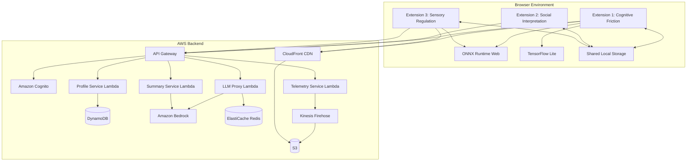

# Design Document: Adaptive Autism Support System

## Overview

The Adaptive Autism Support System is a privacy-first, continuously learning platform consisting of three Chrome extensions backed by AWS serverless infrastructure. The system uses behavioral modeling, on-device machine learning, and selective cloud AI to create personalized digital experiences for autistic users.

### Requirements Coverage

This design document addresses all 30 requirements from the requirements.md file:

**User Authentication and Profile Management**:
- Requirement 1: Covered in "Amazon Cognito" and "Profile Service Lambda" sections

**Extension 1: Learning Cognitive Friction & Confusion**:
- Requirement 2: Covered in "Behavioral Signal Capture Module"
- Requirement 3: Covered in "On-Device Inference Engine"
- Requirement 4: Covered in "Personal Cognitive Adaptation Model"
- Requirement 5: Covered in "UI Adaptation Engine"

**Extension 2: Real-Time Social & Communication Interpretation**:
- Requirement 6: Covered in "Caption Detection Module"
- Requirement 7: Covered in "Semantic Analysis Engine" and "Hybrid Inference Pipeline"
- Requirement 8: Covered in "Visual Analysis Module"
- Requirement 9: Covered in "Overlay Rendering Engine"
- Requirement 10: Covered in "Meeting Summary Generator"

**Extension 3: Sensory Stress & Overload Regulation**:
- Requirement 11: Covered in "Visual Feature Extraction Module"
- Requirement 12: Covered in "Audio Feature Extraction Module"
- Requirement 13: Covered in "On-Device Sensory Stress Model"
- Requirement 14: Covered in "Proportional Intervention Engine"
- Requirement 15: Covered in "Continuous Learning Module"

**AWS Backend Infrastructure**:
- Requirement 16: Covered in "Amazon API Gateway"
- Requirement 17: Covered in "Profile Service Lambda"
- Requirement 18: Covered in "LLM Proxy Lambda"
- Requirement 19: Covered in "Summary Service Lambda"
- Requirement 20: Covered in "Model Update Manager" and "S3 Buckets"
- Requirement 21: Covered in "Telemetry Service Lambda"
- Requirement 22: Covered in "Configuration Service"

**System-Wide Requirements**:
- Requirement 23: Covered in "Cross-Extension Communication" and "Shared State Manager"
- Requirement 24: Covered in "Privacy and Security Properties" and "Security Measures"
- Requirement 25: Covered in "Transparency and Control Properties" and "Intervention Explanation"
- Requirement 26: Covered in "Performance Properties" and "Performance Testing"
- Requirement 27: Covered in "Accessibility Properties" and "Accessibility Compliance"
- Requirement 28: Covered in "Error Handling" section
- Requirement 29: Covered in "Model Training Pipeline"
- Requirement 30: Covered in "Compliance and Regulations" and "Consent Requirement"

### Core Design Principles

1. **Privacy-First Architecture**: Most inference runs on-device; cloud AI invoked only for heavy semantic reasoning
2. **Continuous Learning**: System treats initial profiles as hypotheses, continuously refining through user interaction
3. **Probabilistic Decision-Making**: All interventions based on probability estimates with transparency and reversibility
4. **Proportional Response**: Intervention intensity scales with detected severity
5. **User Agency**: All adaptations are reversible and explainable
6. **Consent-Driven**: Explicit user permission required for all data collection

### System Architecture




## Architecture

### Extension 1: Learning Cognitive Friction & Confusion

**Purpose**: Detect cognitive overload through behavioral signal analysis and adapt ALL web page interfaces to reduce friction. This extension is responsible for all UX modifications on web pages to make them more comfortable and explainable for autistic users.

**Components**:

1. **Behavioral Signal Capture Module**
   - Cursor tracking: Captures x/y coordinates at 60Hz using `mousemove` events
   - Hesitation detection: Identifies pauses >2s using velocity threshold
   - Scroll analysis: Tracks `scroll` events with velocity and direction computation
   - Navigation monitoring: Observes `popstate` and `hashchange` events
   - Decision latency: Measures time between hover and click events

2. **Feature Engineering Module**
   - Temporal feature extraction:
     - Hesitation Index = (total_pause_time / total_interaction_time)
     - Navigation Instability = (back_forward_count / page_view_count)
     - Decision Latency = mean(hover_to_click_times)
     - Scroll Oscillation = variance(scroll_direction_changes)
     - Cursor Velocity Variance = std_dev(cursor_velocities)
   - Rolling window: 30-second sliding window for temporal patterns
   - Feature normalization: Z-score normalization using running statistics

3. **On-Device Inference Engine**
   - Runtime: ONNX Runtime Web (primary) or TensorFlow Lite (fallback)
   - Model architecture: Lightweight LSTM (2 layers, 64 hidden units) for temporal patterns
   - Input: 30-second window of normalized temporal features (5 features × 30 samples)
   - Output: Confusion probability [0.0-1.0], Cognitive load [0.0-1.0]
   - Inference latency target: <100ms
   - Model size: <5MB for fast loading

4. **Personal Cognitive Adaptation Model**
   - Learning algorithm: Contextual multi-armed bandit with Thompson sampling
   - State space: (confusion_prob, cognitive_load, page_complexity, time_of_day)
   - Action space: {reduce_clutter, stabilize_layout, simplify_text, highlight_actions, no_intervention}
   - Reward signal: User response (task_completion=+1, reversal=-1, continued_engagement=+0.5)
   - Update frequency: After each intervention with observed outcome
   - Exploration rate: ε-greedy with ε=0.1 (10% random exploration)

5. **UI Adaptation Engine** (Handles ALL web page UX modifications)
   - Clutter reduction: CSS injection to hide elements with low interaction probability
   - Layout stabilization: Disable CSS animations, fix positions, pause auto-play
   - Text simplification: Replace complex phrases using local dictionary (no cloud calls)
   - Action highlighting: Add visual emphasis (border, shadow, color) to primary buttons
   - Proportional scaling: Intervention intensity = min(1.0, detected_severity × user_sensitivity)
   - Explainability overlays: Show tooltips explaining why changes were made
   - Comfort mode: Adjust spacing, font sizes, contrast for better readability
   - Navigation assistance: Highlight navigation paths and breadcrumbs
   - Form simplification: Break complex forms into steps, add inline help

6. **Model Update Manager**
   - Checks S3 manifest every 24 hours for new model versions
   - Downloads weights via CloudFront with integrity verification (SHA-256)
   - Loads new model in background, swaps atomically
   - Maintains fallback to previous version on load failure

**Data Flow**:
```
User Interaction → Signal Capture → Feature Engineering → On-Device Inference → 
Adaptation Decision → UI Intervention → User Response → Model Learning → 
Periodic Upload (anonymized) → Backend Model Training → Updated Weights → Download
```


### Extension 2: Real-Time Social & Communication Interpretation

**Purpose**: Provide real-time interpretation of social communication in video meetings through hybrid on-device and cloud AI.

**Components**:

1. **Caption Detection Module**
   - DOM observation: MutationObserver watching for caption element changes
   - Platform adapters:
     - Google Meet: `.a4cQT` (caption container)
     - Zoom: `.caption-line-item` 
     - Microsoft Teams: `.closed-captions-container`
     - Generic: `[role="log"]`, `[aria-live="polite"]`
   - Adaptive selector: Falls back through selector list on detection failure
   - Text extraction: innerText with whitespace normalization
   - Utterance segmentation: Split on sentence boundaries, merge fragments

2. **Conversational Context Manager**
   - Sliding window: Last 10 utterances with timestamps
   - Speaker tracking: Extract speaker names from caption metadata
   - Turn-taking detection: Identify speaker changes and pauses
   - Topic segmentation: Detect topic shifts using keyword similarity
   - Context serialization: Format for LLM consumption (speaker: text format)

3. **Hybrid Inference Pipeline**
   - **Rule-Based Classifier** (on-device, <10ms):
     - Question detection: Regex for question marks, WH-words, auxiliary inversion
     - Request detection: Modal verbs (could, would, can) + you/we
     - Common idioms: Dictionary lookup for 500 common expressions
     - Sarcasm indicators: "yeah right", "sure", excessive punctuation
   - **Cloud LLM Fallback** (via Backend, ~500ms):
     - Triggered when: Rule confidence <0.7 or unknown pattern
     - Prompt template: "Analyze this utterance in context: [context]. Utterance: [text]. Provide: intent, literal meaning, implied meaning, tone."
     - Model: Claude 3 Haiku via Bedrock (fast, cost-effective)
     - Response parsing: Extract JSON fields from LLM response

4. **Semantic Analysis Engine**
   - Intent classification: {question, request, statement, joke, sarcasm, agreement, disagreement}
   - Indirect phrasing detection: Compare literal vs. contextual meaning
   - Figurative expression handling: Idiom database + LLM interpretation
   - Tone annotation: {neutral, urgent, humorous, sarcastic, concerned}
   - Confidence scoring: Combine rule-based and LLM confidence scores

5. **Visual Analysis Module**
   - Face detection: MediaPipe Face Landmarker running at 5fps
   - Expression estimation: Map facial landmarks to expression categories
   - Categories: {neutral, happy, concerned, confused, frustrated, surprised}
   - On-device processing: All computation in browser, no frame upload
   - Privacy controls: Explicit permission, visual indicator when active, instant disable

6. **Overlay Rendering Engine**
   - Overlay types:
     - Clarification bubble: Shows plain-language explanation of indirect phrasing
     - Decision highlight: Yellow background on decision-related text
     - Speaking prompt: Green indicator suggesting appropriate speaking window
     - Expression label: Small badge showing detected expression
   - Positioning: Absolute positioning near caption area, collision avoidance
   - Auto-dismiss: 5-second timeout or manual close
   - Queue management: Max 3 simultaneous overlays, queue additional
   - Styling: Minimal design, customizable opacity/size

7. **Meeting Summary Generator**
   - Trigger: Meeting end detection (DOM changes) or manual user trigger
   - Preprocessing: Concatenate all utterances with speaker labels
   - Chunking: Split into 4000-token chunks if exceeds limit
   - LLM prompt: "Extract from this meeting: 1) Decisions made, 2) Tasks assigned with owners, 3) Deadlines mentioned, 4) Action items. Format as JSON."
   - Model: Claude 3 Sonnet via Bedrock (better reasoning for extraction)
   - Post-processing: Parse JSON, validate structure, format for display
   - Storage: IndexedDB with meeting metadata (date, platform, duration)
   - Export: Markdown and plain text formats

**Data Flow**:
```
Caption DOM Change → Text Extraction → Context Window Update → 
Rule-Based Analysis → [If needed] Cloud LLM Call → Semantic Interpretation → 
Overlay Rendering → User Interaction → Meeting End → Summary Generation → 
Local Storage
```


### Extension 3: Sensory Stress & Overload Regulation

**Purpose**: Detect and mitigate sensory overload ONLY from video and audio media content through real-time analysis and proportional interventions. This extension does NOT modify web page layouts or general UI elements - it focuses exclusively on video/audio player controls and media content adjustments.

**Components**:

1. **Visual Feature Extraction Module**
   - Frame sampling: Canvas API to capture video frames at 10fps
   - Brightness volatility: 
     - Compute mean luminance per frame: L = 0.299R + 0.587G + 0.114B
     - Frame-to-frame difference: ΔL = |L(t) - L(t-1)|
     - Volatility score: mean(ΔL) over 1-second window
   - Flash frequency:
     - Count brightness changes >10% within 1-second window
     - Weighted by change magnitude
   - Contrast oscillation:
     - Compute Michelson contrast: C = (L_max - L_min) / (L_max + L_min)
     - Track variance of C over 2-second window
   - Motion turbulence:
     - Optical flow using Lucas-Kanade method (sparse)
     - Magnitude: sqrt(vx² + vy²)
     - Direction variance: circular variance of flow angles
     - Turbulence score: magnitude × direction_variance

2. **Audio Feature Extraction Module**
   - Audio capture: Web Audio API with AnalyserNode
   - Amplitude envelope:
     - RMS calculation over 100ms windows
     - Envelope = sqrt(mean(samples²))
   - Peak burst detection:
     - Identify samples exceeding 2× rolling average
     - Count bursts per second
   - Spectral harshness:
     - FFT analysis (2048-point)
     - High-frequency energy: sum(magnitude[4kHz:8kHz]) / sum(magnitude[total])
     - Harshness score: weighted by frequency band discomfort curve
   - Dynamic spikes:
     - Loudness in LUFS (ITU-R BS.1770)
     - Track sudden changes >6 LUFS within 1 second

3. **On-Device Sensory Stress Model**
   - Runtime: ONNX Runtime Web
   - Model architecture: Temporal CNN (3 conv layers) + LSTM (1 layer, 32 units)
   - Input: Multi-modal feature vector (8 visual + 4 audio features) × 10-second window
   - Output: Overload probability [0.0-1.0], Trajectory prediction [10 future timesteps]
   - Personalization: Model incorporates user-specific thresholds from profile
   - Inference latency: <100ms
   - Model size: <3MB

4. **Proportional Intervention Engine**
   - **Dimming**:
     - Trigger: overload_prob > 0.6
     - Intensity: 10% + (30% × overload_prob)
     - Implementation: CSS filter brightness() on video element
   - **Contrast Softening**:
     - Trigger: contrast_oscillation > user_threshold
     - Intensity: Reduce contrast by (oscillation_severity × 0.3)
     - Implementation: CSS filter contrast()
   - **Flash Damping**:
     - Trigger: flash_frequency > 3 per second
     - Method: Temporal smoothing using exponential moving average
     - Implementation: Canvas-based frame interpolation
   - **Motion Smoothing**:
     - Trigger: motion_turbulence > user_threshold
     - Method: Reduce effective frame rate or apply motion blur
     - Implementation: Skip frames or CSS filter blur()
   - **Audio Compression**:
     - Trigger: dynamic_spikes > user_threshold
     - Method: DynamicsCompressorNode with adaptive ratio
     - Parameters: threshold=-20dB, ratio=4:1, attack=5ms, release=50ms

5. **Continuous Learning Module**
   - User response signals:
     - Continued viewing: Positive signal (reward=+0.5)
     - Manual adjustment: Strong signal (reward=±1.0 based on direction)
     - Content abandonment: Negative signal (reward=-1.0)
     - Explicit feedback: User rating (reward=-1.0 to +1.0)
   - Sensitivity curve update:
     - Bayesian updating of threshold distributions
     - Per-feature thresholds: P(threshold | observations)
     - Convergence: After 50+ interventions per feature type
   - Batch upload: Anonymized (feature_type, threshold_adjustment, outcome) tuples
   - Backend aggregation: Cluster users by sensitivity profiles, update model weights

6. **Video Player Integration** (Media-only interventions)
   - Supported players:
     - HTML5 video: Direct element access
     - YouTube: IFrame API + DOM manipulation
     - Vimeo: Player API
     - Netflix: DOM-based (best effort)
   - Intervention injection: CSS filters on video element, canvas overlay, or Web Audio routing
   - Player controls: Add sensory control panel to video player UI
   - Warning overlays: Predictive warnings before intense sensory moments
   - Fallback: If player blocks intervention, show warning overlay
   - NOTE: Does NOT modify surrounding web page UI - only video/audio elements

**Data Flow**:
```
Video/Audio Playback → Feature Extraction (parallel) → On-Device Inference → 
Overload Prediction → Intervention Decision → Apply Proportional Intervention → 
User Response Observation → Sensitivity Curve Update → Periodic Upload → 
Backend Aggregation → Updated Model Weights → Download
```


### AWS Backend Architecture

**Design Philosophy**: Serverless, auto-scaling, pay-per-use architecture optimized for variable load and global distribution.

**Components**:

1. **Amazon Cognito - Authentication Service**
   - User pools: Manage user registration, authentication, password reset
   - Identity providers: Support Google, Microsoft, Apple OAuth
   - JWT tokens: Access tokens (1 hour TTL), refresh tokens (30 days TTL)
   - Token scopes: `profile:read`, `profile:write`, `llm:invoke`, `telemetry:write`
   - MFA support: Optional TOTP-based multi-factor authentication
   - Custom attributes: User sensitivity profiles, feature flags

2. **Amazon API Gateway - Request Router**
   - REST API with regional endpoints
   - Authorizer: Cognito JWT validation
   - Rate limiting: 100 requests/minute per user (token bucket algorithm)
   - Request validation: JSON schema validation on request bodies
   - CORS configuration: Allow extension origins only
   - Endpoints:
     - `GET /profile` - Retrieve user profile
     - `PUT /profile` - Update user profile
     - `POST /llm/interpret` - Request utterance interpretation
     - `POST /llm/summarize` - Generate meeting summary
     - `POST /telemetry` - Upload anonymized telemetry
     - `GET /config` - Fetch configuration bundle
     - `GET /models/manifest` - Get latest model versions

3. **Profile Service Lambda**
   - Runtime: Node.js 20.x
   - Memory: 512MB
   - Timeout: 10 seconds
   - Operations:
     - `getProfile(userId)`: Query DynamoDB, return profile JSON
     - `updateProfile(userId, updates)`: Validate schema, conditional write to DynamoDB
     - `createProfile(userId, initialSettings)`: Initialize new user profile
   - DynamoDB schema:
     ```json
     {
       "userId": "string (partition key)",
       "version": "number (for optimistic locking)",
       "cognitiveThresholds": {
         "confusionTrigger": 0.7,
         "cognitiveLoadTrigger": 0.8
       },
       "sensoryThresholds": {
         "brightnessVolatility": 0.15,
         "flashFrequency": 3.0,
         "motionTurbulence": 0.6,
         "audioHarshness": 0.5
       },
       "preferences": {
         "enableClutterReduction": true,
         "enableTextSimplification": true,
         "enableVisualAnalysis": false,
         "overlayOpacity": 0.9
       },
       "featureFlags": {
         "betaFeatures": false,
         "experimentGroup": "control"
       },
       "createdAt": "ISO8601 timestamp",
       "updatedAt": "ISO8601 timestamp"
     }
     ```

4. **LLM Proxy Lambda**
   - Runtime: Python 3.12
   - Memory: 1024MB
   - Timeout: 30 seconds
   - Operations:
     - `interpretUtterance(text, context)`: Analyze conversational intent
     - Cache strategy: Hash(text + context) as Redis key, 24-hour TTL
   - Bedrock integration:
     - Model: Claude 3 Haiku (`anthropic.claude-3-haiku-20240307-v1:0`)
     - Temperature: 0.3 (consistent interpretations)
     - Max tokens: 500
     - Prompt template:
       ```
       You are analyzing conversation for an autistic user who needs help understanding indirect communication.
       
       Context (previous utterances):
       {context}
       
       Current utterance: "{text}"
       
       Provide a JSON response with:
       - intent: question|request|statement|joke|sarcasm
       - literalMeaning: what the words literally say
       - impliedMeaning: what the speaker actually means
       - tone: neutral|urgent|humorous|sarcastic|concerned
       - confidence: 0.0-1.0
       ```
   - Error handling: Return fallback response on Bedrock failure

5. **Summary Service Lambda**
   - Runtime: Python 3.12
   - Memory: 2048MB (for large meeting transcripts)
   - Timeout: 60 seconds
   - Operations:
     - `generateSummary(utterances)`: Extract structured information
   - Chunking strategy: Split at 4000 tokens, process incrementally, merge results
   - Bedrock integration:
     - Model: Claude 3 Sonnet (`anthropic.claude-3-sonnet-20240229-v1:0`)
     - Temperature: 0.2 (factual extraction)
     - Max tokens: 2000
     - Prompt template:
       ```
       Extract key information from this meeting transcript for an autistic user who needs structured summaries.
       
       Transcript:
       {utterances}
       
       Provide a JSON response with:
       - decisions: [{text, timestamp, participants}]
       - tasks: [{description, assignee, deadline}]
       - deadlines: [{date, description}]
       - actionItems: [{description, owner}]
       - keyTopics: [string]
       ```

6. **Telemetry Service Lambda**
   - Runtime: Node.js 20.x
   - Memory: 256MB
   - Timeout: 5 seconds
   - Operations:
     - `ingestTelemetry(anonymizedData)`: Validate and stream to Kinesis
   - Validation: Ensure no PII, check data schema
   - Kinesis Firehose: Batch to S3 every 5 minutes or 5MB
   - S3 lifecycle: Delete after 90 days

6a. **Configuration Service** (Requirement 22)
   - Storage: S3 config-bucket with versioned configuration bundles
   - Distribution: CloudFront CDN for global low-latency access
   - Configuration types:
     - **Threshold Policies**: Default and profile-specific thresholds for cognitive load and sensory stress
     - **Feature Flags**: Enable/disable features, beta features, A/B test assignments
     - **UI Templates**: Overlay styles, intervention templates, customization options
   - Update mechanism:
     - Extensions poll S3 manifest every 5 minutes for configuration version
     - On version change, download new configuration bundle via CloudFront
     - Apply new configuration without requiring extension reload
   - A/B Testing:
     - User assignment based on userId hash (deterministic, stable)
     - Experiment groups defined in feature flags
     - Telemetry tagged with experiment group for analysis
   - Fallback strategy:
     - If S3 unavailable, use embedded default configuration
     - If configuration invalid, fall back to previous valid version
     - Log configuration errors for monitoring

7. **DynamoDB Tables**
   - **UserProfiles**:
     - Partition key: userId (string)
     - Capacity: On-demand (auto-scaling)
     - Encryption: AWS KMS
     - Point-in-time recovery: Enabled
   - **ConfigCache** (optional):
     - Partition key: configKey (string)
     - TTL: Enabled (auto-delete expired configs)

8. **S3 Buckets**
   - **model-weights-bucket**:
     - Versioning: Enabled
     - Encryption: SSE-S3
     - Objects: `cognitive-model-v{version}.onnx`, `sensory-model-v{version}.onnx`
     - Manifest: `manifest.json` with latest versions and checksums
   - **config-bucket**:
     - Objects: `thresholds.json`, `feature-flags.json`, `ui-templates.json`
   - **telemetry-bucket**:
     - Partitioning: `year=YYYY/month=MM/day=DD/hour=HH/`
     - Lifecycle: Delete after 90 days

9. **ElastiCache Redis Cluster**
   - Node type: cache.t4g.micro (for development), cache.r7g.large (for production)
   - Cluster mode: Disabled (single shard for simplicity)
   - Encryption: In-transit and at-rest
   - Use cases:
     - LLM response caching (key: hash, value: JSON, TTL: 24h)
     - Configuration caching (key: config_name, value: JSON, TTL: 5min)
     - Rate limiting counters (key: userId, value: count, TTL: 60s)

10. **CloudFront CDN**
    - Origins: S3 buckets (model-weights, config)
    - Cache behavior: Aggressive caching (24-hour TTL for models, 5-minute for configs)
    - Geographic distribution: Global edge locations
    - Signed URLs: For model downloads (1-hour expiration)
    - Compression: Gzip/Brotli for JSON configs

11. **Amazon Kinesis Firehose**
    - Source: Telemetry Service Lambda
    - Destination: S3 telemetry bucket
    - Buffering: 5 minutes or 5MB
    - Transformation: Optional Lambda for additional anonymization
    - Format: JSON lines (newline-delimited JSON)


## Components and Interfaces

### Extension Interfaces

**Extension 1: Cognitive Friction API**

```typescript
interface BehavioralSignal {
  timestamp: number;
  cursorVelocity: number;
  hesitationDuration: number;
  scrollVelocity: number;
  scrollDirectionChanges: number;
  navigationEvents: number;
  decisionLatency: number;
}

interface TemporalFeatures {
  hesitationIndex: number;      // [0.0-1.0]
  navigationInstability: number; // [0.0-1.0]
  decisionLatency: number;       // milliseconds
  scrollOscillation: number;     // variance
  cursorVelocityVariance: number;
}

interface CognitiveState {
  confusionProbability: number;  // [0.0-1.0]
  cognitiveLoad: number;         // [0.0-1.0]
  confidence: number;            // [0.0-1.0]
  timestamp: number;
}

interface AdaptationAction {
  type: 'reduce_clutter' | 'stabilize_layout' | 'simplify_text' | 'highlight_actions' | 'none';
  intensity: number;             // [0.0-1.0]
  targetElements: string[];      // CSS selectors
  reason: string;                // Explanation for user
}

interface UserResponse {
  action: 'task_completed' | 'intervention_reversed' | 'continued_engagement' | 'abandoned';
  timestamp: number;
  interventionId: string;
}

class CognitiveFrictionDetector {
  captureSignals(): BehavioralSignal;
  extractFeatures(signals: BehavioralSignal[]): TemporalFeatures;
  inferCognitiveState(features: TemporalFeatures): Promise<CognitiveState>;
  decideAdaptation(state: CognitiveState): AdaptationAction;
  applyAdaptation(action: AdaptationAction): void;
  observeResponse(): UserResponse;
  updateModel(response: UserResponse): void;
}
```

**Extension 2: Social Interpretation API**

```typescript
interface Utterance {
  text: string;
  speaker: string;
  timestamp: number;
  platform: 'google-meet' | 'zoom' | 'teams' | 'generic';
}

interface ConversationalContext {
  recentUtterances: Utterance[];  // Last 10
  currentSpeaker: string;
  topicKeywords: string[];
}

interface SemanticInterpretation {
  intent: 'question' | 'request' | 'statement' | 'joke' | 'sarcasm' | 'agreement' | 'disagreement';
  literalMeaning: string;
  impliedMeaning: string;
  tone: 'neutral' | 'urgent' | 'humorous' | 'sarcastic' | 'concerned';
  confidence: number;             // [0.0-1.0]
  requiresClarification: boolean;
}

interface FacialExpression {
  category: 'neutral' | 'happy' | 'concerned' | 'confused' | 'frustrated' | 'surprised';
  confidence: number;
  landmarks: number[][];          // MediaPipe landmarks (not stored)
}

interface Overlay {
  type: 'clarification' | 'decision_highlight' | 'speaking_prompt' | 'expression_label';
  content: string;
  position: {x: number, y: number};
  duration: number;               // milliseconds
  dismissible: boolean;
}

interface MeetingSummary {
  decisions: Array<{text: string, timestamp: number, participants: string[]}>;
  tasks: Array<{description: string, assignee: string, deadline?: string}>;
  deadlines: Array<{date: string, description: string}>;
  actionItems: Array<{description: string, owner: string}>;
  keyTopics: string[];
  meetingMetadata: {
    date: string,
    platform: string,
    duration: number,
    participantCount: number
  };
}

class SocialInterpretationEngine {
  detectCaptions(): Utterance | null;
  updateContext(utterance: Utterance): void;
  analyzeSemantics(utterance: Utterance, context: ConversationalContext): Promise<SemanticInterpretation>;
  analyzeFacialExpression(): Promise<FacialExpression | null>;
  renderOverlay(interpretation: SemanticInterpretation): void;
  generateSummary(utterances: Utterance[]): Promise<MeetingSummary>;
}
```

**Extension 3: Sensory Regulation API**

```typescript
interface VisualFeatures {
  brightnessVolatility: number;   // [0.0-1.0]
  flashFrequency: number;         // flashes per second
  contrastOscillation: number;    // variance
  motionTurbulence: number;       // [0.0-1.0]
  timestamp: number;
}

interface AudioFeatures {
  amplitudeEnvelope: number;      // RMS
  peakBurstCount: number;         // per second
  spectralHarshness: number;      // [0.0-1.0]
  dynamicSpikes: number;          // LUFS change rate
  timestamp: number;
}

interface SensoryStressState {
  overloadProbability: number;    // [0.0-1.0]
  trajectory: number[];           // Next 10 timesteps
  dominantStressor: 'visual' | 'audio' | 'both';
  confidence: number;
}

interface SensoryIntervention {
  visual: {
    dimming: number;              // [0.0-1.0]
    contrastReduction: number;    // [0.0-1.0]
    flashDamping: boolean;
    motionSmoothing: number;      // [0.0-1.0]
  };
  audio: {
    compressionRatio: number;     // [1.0-10.0]
    threshold: number;            // dB
  };
  intensity: number;              // Overall [0.0-1.0]
}

interface SensitivityThresholds {
  brightnessVolatility: number;
  flashFrequency: number;
  contrastOscillation: number;
  motionTurbulence: number;
  audioHarshness: number;
  dynamicSpikes: number;
}

class SensoryRegulationEngine {
  extractVisualFeatures(videoElement: HTMLVideoElement): VisualFeatures;
  extractAudioFeatures(audioContext: AudioContext): AudioFeatures;
  inferSensoryStress(visual: VisualFeatures, audio: AudioFeatures): Promise<SensoryStressState>;
  decideIntervention(state: SensoryStressState, thresholds: SensitivityThresholds): SensoryIntervention;
  applyIntervention(intervention: SensoryIntervention, target: HTMLVideoElement): void;
  observeUserResponse(): 'continued' | 'adjusted' | 'abandoned';
  updateSensitivityCurves(response: string, intervention: SensoryIntervention): void;
}
```

### Backend Service Interfaces

**Profile Service API**

```typescript
interface UserProfile {
  userId: string;
  version: number;
  cognitiveThresholds: {
    confusionTrigger: number;
    cognitiveLoadTrigger: number;
  };
  sensoryThresholds: SensitivityThresholds;
  preferences: {
    enableClutterReduction: boolean;
    enableTextSimplification: boolean;
    enableVisualAnalysis: boolean;
    overlayOpacity: number;
    interventionAggressiveness: number;
  };
  featureFlags: {
    betaFeatures: boolean;
    experimentGroup: string;
  };
  createdAt: string;
  updatedAt: string;
}

interface ProfileService {
  getProfile(userId: string): Promise<UserProfile>;
  updateProfile(userId: string, updates: Partial<UserProfile>): Promise<UserProfile>;
  createProfile(userId: string, initialSettings: Partial<UserProfile>): Promise<UserProfile>;
}
```

**LLM Proxy API**

```typescript
interface InterpretationRequest {
  text: string;
  context: string[];              // Previous utterances
  userId: string;                 // For rate limiting
}

interface InterpretationResponse {
  intent: string;
  literalMeaning: string;
  impliedMeaning: string;
  tone: string;
  confidence: number;
  cached: boolean;                // Was this from cache?
}

interface SummaryRequest {
  utterances: Array<{speaker: string, text: string, timestamp: number}>;
  userId: string;
}

interface SummaryResponse {
  summary: MeetingSummary;
  processingTime: number;
}

interface LLMProxyService {
  interpretUtterance(request: InterpretationRequest): Promise<InterpretationResponse>;
  generateSummary(request: SummaryRequest): Promise<SummaryResponse>;
}
```

**Telemetry Service API**

```typescript
interface TelemetryEvent {
  eventType: 'cognitive_adaptation' | 'sensory_intervention' | 'social_interpretation';
  anonymizedData: {
    featureValues: number[];      // Anonymized feature vectors
    interventionType: string;
    outcome: string;
    timestamp: number;            // Rounded to hour
  };
  // NO userId, NO raw data, NO PII
}

interface TelemetryService {
  ingest(events: TelemetryEvent[]): Promise<void>;
}
```

### Cross-Extension Communication

**Shared State Manager**

```typescript
interface SharedState {
  globalInterventionActive: boolean;
  activeInterventions: Array<{
    extensionId: string;
    type: string;
    severity: number;
    startTime: number;
  }>;
  userPreferences: UserProfile['preferences'];
  coordinationMode: 'independent' | 'coordinated';
}

class SharedStateManager {
  static getInstance(): SharedStateManager;
  
  getState(): SharedState;
  setState(updates: Partial<SharedState>): void;
  
  registerIntervention(extensionId: string, type: string, severity: number): string;
  unregisterIntervention(interventionId: string): void;
  
  shouldDeferIntervention(extensionId: string, severity: number): boolean;
  getPriorityOrder(): string[];  // Returns extension IDs in priority order
  
  subscribe(callback: (state: SharedState) => void): void;
  unsubscribe(callback: (state: SharedState) => void): void;
}
```


## Data Models

### Extension Local Storage Models

**Extension 1: Cognitive Adaptation State**

```typescript
interface CognitiveAdaptationState {
  modelVersion: string;
  lastModelUpdate: number;
  adaptationHistory: Array<{
    timestamp: number;
    features: TemporalFeatures;
    cognitiveState: CognitiveState;
    action: AdaptationAction;
    response: UserResponse;
  }>;  // Max 1000 entries, FIFO
  
  learningStatistics: {
    totalInterventions: number;
    successfulInterventions: number;
    reversedInterventions: number;
    explorationRate: number;
  };
  
  actionValueEstimates: {
    [stateKey: string]: {
      [action: string]: {
        mean: number;
        variance: number;
        sampleCount: number;
      }
    }
  };
}
```

**Extension 2: Meeting Data**

```typescript
interface MeetingRecord {
  meetingId: string;
  startTime: number;
  endTime: number;
  platform: string;
  utterances: Utterance[];        // Full transcript
  interpretations: Array<{
    utteranceId: string;
    interpretation: SemanticInterpretation;
  }>;
  summary: MeetingSummary;
  userNotes: string;
}

interface InterpretationCache {
  [utteranceHash: string]: {
    interpretation: SemanticInterpretation;
    timestamp: number;
    hitCount: number;
  }
}
```

**Extension 3: Sensory Adaptation State**

```typescript
interface SensoryAdaptationState {
  modelVersion: string;
  lastModelUpdate: number;
  
  sensitivityCurves: {
    brightnessVolatility: {
      threshold: number;
      confidence: number;
      observations: number;
    };
    flashFrequency: {
      threshold: number;
      confidence: number;
      observations: number;
    };
    // ... similar for other features
  };
  
  interventionHistory: Array<{
    timestamp: number;
    features: {visual: VisualFeatures, audio: AudioFeatures};
    stressState: SensoryStressState;
    intervention: SensoryIntervention;
    userResponse: string;
    contentType: string;          // 'video' | 'animation' | 'game'
  }>;  // Max 500 entries, FIFO
  
  contentTypePreferences: {
    [contentType: string]: {
      preferredIntensity: number;
      interventionCount: number;
    }
  };
}
```

### Backend Data Models

**DynamoDB: UserProfiles Table**

```json
{
  "userId": "string (partition key)",
  "version": "number",
  "cognitiveThresholds": {
    "confusionTrigger": "number",
    "cognitiveLoadTrigger": "number"
  },
  "sensoryThresholds": {
    "brightnessVolatility": "number",
    "flashFrequency": "number",
    "contrastOscillation": "number",
    "motionTurbulence": "number",
    "audioHarshness": "number",
    "dynamicSpikes": "number"
  },
  "preferences": {
    "enableClutterReduction": "boolean",
    "enableTextSimplification": "boolean",
    "enableVisualAnalysis": "boolean",
    "overlayOpacity": "number",
    "interventionAggressiveness": "number"
  },
  "featureFlags": {
    "betaFeatures": "boolean",
    "experimentGroup": "string"
  },
  "modelVersions": {
    "cognitiveModel": "string",
    "sensoryModel": "string"
  },
  "statistics": {
    "totalInterventions": "number",
    "lastActiveDate": "string",
    "installDate": "string"
  },
  "createdAt": "string (ISO8601)",
  "updatedAt": "string (ISO8601)"
}
```

**S3: Model Manifest**

```json
{
  "version": "1.0",
  "lastUpdated": "2024-01-15T10:30:00Z",
  "models": {
    "cognitive-friction": {
      "version": "2.3.1",
      "url": "https://cdn.example.com/models/cognitive-model-v2.3.1.onnx",
      "checksum": "sha256:abc123...",
      "size": 4857600,
      "releaseNotes": "Improved hesitation detection accuracy"
    },
    "sensory-stress": {
      "version": "1.8.0",
      "url": "https://cdn.example.com/models/sensory-model-v1.8.0.onnx",
      "checksum": "sha256:def456...",
      "size": 2945024,
      "releaseNotes": "Added audio compression support"
    }
  },
  "minimumExtensionVersions": {
    "extension-1": "1.5.0",
    "extension-2": "1.3.0",
    "extension-3": "1.6.0"
  }
}
```

**S3: Configuration Bundle**

```json
{
  "version": "1.2",
  "thresholds": {
    "default": {
      "cognitive": {
        "confusionTrigger": 0.7,
        "cognitiveLoadTrigger": 0.8
      },
      "sensory": {
        "brightnessVolatility": 0.15,
        "flashFrequency": 3.0,
        "contrastOscillation": 0.2,
        "motionTurbulence": 0.6,
        "audioHarshness": 0.5,
        "dynamicSpikes": 6.0
      }
    },
    "profiles": {
      "high-sensitivity": {
        "cognitive": {"confusionTrigger": 0.5, "cognitiveLoadTrigger": 0.6},
        "sensory": {"brightnessVolatility": 0.08, "flashFrequency": 2.0}
      },
      "low-sensitivity": {
        "cognitive": {"confusionTrigger": 0.85, "cognitiveLoadTrigger": 0.9},
        "sensory": {"brightnessVolatility": 0.25, "flashFrequency": 5.0}
      }
    }
  },
  "featureFlags": {
    "enableBetaFeatures": false,
    "enableVisualAnalysis": true,
    "enableTelemetry": true
  },
  "uiTemplates": {
    "overlayStyles": {
      "clarification": "background: rgba(255, 255, 200, 0.9); border-radius: 8px;",
      "decision": "background: rgba(255, 255, 100, 0.7); font-weight: bold;",
      "speaking": "background: rgba(100, 255, 100, 0.8); border: 2px solid green;"
    }
  }
}
```

**Kinesis/S3: Telemetry Event Schema**

```json
{
  "eventType": "cognitive_adaptation",
  "timestamp": "2024-01-15T10:00:00Z",
  "anonymizedData": {
    "featureVector": [0.45, 0.62, 0.31, 0.78, 0.55],
    "interventionType": "reduce_clutter",
    "interventionIntensity": 0.6,
    "outcome": "task_completed",
    "pageComplexity": 0.72,
    "timeOfDay": "morning",
    "sessionDuration": 1847
  },
  "modelVersion": "2.3.1",
  "extensionVersion": "1.5.2"
}
```

### ML Model Specifications

**Cognitive Friction Model (ONNX)**

- **Architecture**: LSTM-based temporal model
- **Input shape**: `[batch_size, sequence_length=30, features=5]`
- **Input features**:
  1. Hesitation index (normalized)
  2. Navigation instability (normalized)
  3. Decision latency (log-scaled, normalized)
  4. Scroll oscillation (normalized)
  5. Cursor velocity variance (normalized)
- **Output shape**: `[batch_size, 2]`
- **Output values**: `[confusion_probability, cognitive_load]`
- **Layers**:
  - LSTM(64 units, return_sequences=True)
  - Dropout(0.2)
  - LSTM(64 units)
  - Dense(32, activation='relu')
  - Dense(2, activation='sigmoid')
- **Training data**: Aggregated anonymized behavioral patterns from 10,000+ users
- **Validation metrics**: AUC-ROC > 0.85, Precision > 0.80, Recall > 0.75

**Sensory Stress Model (ONNX)**

- **Architecture**: Temporal CNN + LSTM
- **Input shape**: `[batch_size, sequence_length=100, features=12]`
- **Input features**:
  - Visual: brightness_volatility, flash_frequency, contrast_oscillation, motion_turbulence (4 features)
  - Audio: amplitude_envelope, peak_burst_count, spectral_harshness, dynamic_spikes (4 features)
  - User thresholds: 4 personalized threshold values
- **Output shape**: `[batch_size, 11]`
- **Output values**: `[current_overload_prob, next_10_timesteps_trajectory]`
- **Layers**:
  - Conv1D(32, kernel_size=5, activation='relu')
  - MaxPooling1D(2)
  - Conv1D(64, kernel_size=3, activation='relu')
  - MaxPooling1D(2)
  - LSTM(32 units)
  - Dense(16, activation='relu')
  - Dense(11, activation='sigmoid')
- **Training data**: Aggregated anonymized sensory patterns with user response labels
- **Validation metrics**: AUC-ROC > 0.82, MAE < 0.15 for trajectory prediction


## Correctness Properties

*A property is a characteristic or behavior that should hold true across all valid executions of a system—essentially, a formal statement about what the system should do. Properties serve as the bridge between human-readable specifications and machine-verifiable correctness guarantees.*

### Authentication and Profile Management Properties

**Property 1: Authentication Token Validity**
*For any* authenticated user session, if the access token is valid, then all API requests with that token should be authorized successfully until the token expires.
**Validates: Requirements 1.2, 1.6**

**Property 2: Profile Persistence Round-Trip**
*For any* user profile update, writing the profile to DynamoDB and then immediately reading it back should return an equivalent profile object.
**Validates: Requirements 1.3, 1.4**

**Property 3: Token Revocation Completeness**
*For any* user logout action, all active tokens should be revoked and all local storage should be cleared, preventing any subsequent authenticated requests.
**Validates: Requirements 1.7**

### Extension 1: Cognitive Friction Properties

**Property 4: Behavioral Signal Privacy**
*For any* captured behavioral signal, the signal data should never contain keystroke content, form data, or personally identifiable information.
**Validates: Requirements 2.7**

**Property 5: Inference Latency Bound**
*For any* on-device cognitive load inference, the computation should complete within 100ms of feature extraction.
**Validates: Requirements 3.3**

**Property 6: Offline Inference Capability**
*For any* cognitive state estimation, the on-device inference should operate successfully without network connectivity.
**Validates: Requirements 3.6**

**Property 7: Adaptation Proportionality**
*For any* detected cognitive load level, the intervention intensity should be proportional to the severity (higher load = stronger intervention).
**Validates: Requirements 5.5**

**Property 8: Intervention Reversibility**
*For any* applied UI adaptation, when a user manually reverses the intervention, the system should record the reversal and adjust future thresholds accordingly.
**Validates: Requirements 5.6, 25.4**

**Property 9: Learning Convergence**
*For any* personal cognitive adaptation model, after accumulating sufficient interaction data (minimum 100 interactions), the model should demonstrate improved prediction accuracy compared to the initial baseline.
**Validates: Requirements 4.5**

### Extension 2: Social Interpretation Properties

**Property 10: Caption Detection Latency**
*For any* new caption text appearing in a video meeting, the extension should extract the text content within 50ms.
**Validates: Requirements 6.2**

**Property 11: Platform Compatibility**
*For any* supported meeting platform (Google Meet, Zoom, Microsoft Teams), the caption detection should successfully extract utterances when captions are enabled.
**Validates: Requirements 6.6**

**Property 12: Context Window Consistency**
*For any* conversational analysis, the system should maintain exactly the last 10 utterances in the context window, removing older utterances as new ones arrive.
**Validates: Requirements 6.3**

**Property 13: Interpretation Caching Effectiveness**
*For any* repeated utterance with identical context, the LLM Proxy should return the cached interpretation within 50ms without invoking Bedrock.
**Validates: Requirements 7.7, 18.3**

**Property 14: Visual Analysis Privacy**
*For any* facial expression analysis, no video frames or facial landmark data should be stored or transmitted outside the browser.
**Validates: Requirements 8.7**

**Property 15: Overlay Auto-Dismiss**
*For any* rendered overlay, the overlay should automatically dismiss after 5 seconds or when manually dismissed by the user, whichever comes first.
**Validates: Requirements 9.5**

**Property 16: Summary Structured Extraction**
*For any* meeting summary generation, the output should contain structured sections for decisions, tasks, deadlines, and action items in valid JSON format.
**Validates: Requirements 10.4**

### Extension 3: Sensory Regulation Properties

**Property 17: Feature Extraction Real-Time Performance**
*For any* video frame analysis, visual feature extraction should complete within 50ms per frame to maintain real-time performance at 10fps.
**Validates: Requirements 11.6**

**Property 18: Audio Privacy**
*For any* audio feature extraction, the system should never record or store raw audio data, only computed feature values.
**Validates: Requirements 12.7**

**Property 19: Sensory Stress Inference Latency**
*For any* sensory stress estimation, on-device inference should complete within 100ms of feature extraction.
**Validates: Requirements 13.4**

**Property 20: Intervention Scaling**
*For any* sensory intervention, the intervention intensity should scale proportionally to the overload probability (higher probability = stronger intervention).
**Validates: Requirements 14.6**

**Property 21: User Adjustment Learning**
*For any* manual intervention strength adjustment by the user, the system should update sensitivity curves to reflect the user's preference for similar sensory patterns in the future.
**Validates: Requirements 14.7, 15.4, 15.5**

### Backend Service Properties

**Property 22: API Gateway Authorization**
*For any* API request with an invalid or expired JWT token, the API Gateway should return 401 Unauthorized without invoking any Lambda functions.
**Validates: Requirements 16.3**

**Property 23: Rate Limiting Enforcement**
*For any* user exceeding 100 requests per minute, the API Gateway should return 429 Too Many Requests for subsequent requests until the rate limit window resets.
**Validates: Requirements 16.4, 16.5**

**Property 24: Profile Update Atomicity**
*For any* concurrent profile update attempts, the Profile Service should use conditional writes to prevent race conditions, returning 409 Conflict when conflicts occur.
**Validates: Requirements 17.4, 17.5**

**Property 25: LLM Proxy Fallback**
*For any* Bedrock request failure, the LLM Proxy should return a graceful fallback response without exposing technical error details to the user.
**Validates: Requirements 18.7**

**Property 26: Meeting Content Ephemeral**
*For any* meeting summary generation, the Backend should not store meeting content after the summary generation completes.
**Validates: Requirements 19.7**

**Property 27: Model Distribution Integrity**
*For any* model weight download, the extension should verify the SHA-256 checksum matches the manifest before loading the model.
**Validates: Requirements 20.5**

### Privacy and Security Properties

**Property 28: Telemetry Anonymization**
*For any* telemetry data uploaded to the Backend, the data should contain no user IDs, timestamps (rounded to hour), URLs, or personally identifiable information.
**Validates: Requirements 21.1, 21.2, 21.6**

**Property 29: On-Device Inference Preference**
*For any* ML inference operation, the system should run on-device inference first and only invoke cloud inference when explicitly required for semantic reasoning.
**Validates: Requirements 24.1**

**Property 30: Data Capture Restrictions**
*For any* behavioral signal capture, the system should never capture keystroke content, form data, passwords, or credit card information.
**Validates: Requirements 24.2**

**Property 31: Consent Requirement**
*For any* telemetry data collection, the system should only collect data after receiving explicit user opt-in consent.
**Validates: Requirements 24.6, 30.2**

**Property 32: Data Deletion Compliance**
*For any* user data deletion request, the Backend should delete all user data within 30 days.
**Validates: Requirements 24.7**

### Transparency and Control Properties

**Property 33: Intervention Explanation**
*For any* applied intervention, the system should provide a visual indicator and explanation of what changed and why when the user requests it.
**Validates: Requirements 25.1, 25.2**

**Property 34: One-Click Reversal**
*For any* active intervention, the system should provide a one-click mechanism to reverse the intervention immediately.
**Validates: Requirements 25.3**

**Property 35: Intervention History Tracking**
*For any* intervention applied, the system should record it in the intervention history accessible via the user dashboard.
**Validates: Requirements 25.5**

### Cross-Extension Coordination Properties

**Property 36: Intervention Priority**
*For any* simultaneous intervention requests from multiple extensions, the system should prioritize based on severity scores to prevent conflicts.
**Validates: Requirements 23.4**

**Property 37: Preference Synchronization**
*For any* user preference change, the system should synchronize the preference across all three extensions via the Backend.
**Validates: Requirements 23.7**

### Performance Properties

**Property 38: Memory Usage Bound**
*For any* extension runtime, the memory usage should not exceed 200MB per extension.
**Validates: Requirements 26.2**

**Property 39: Backend Latency**
*For any* Backend API request under normal load, the p95 latency should be under 500ms.
**Validates: Requirements 26.4**

**Property 40: Non-Blocking Processing**
*For any* CPU-intensive processing in extensions, the work should execute in Web Workers to avoid blocking the main thread.
**Validates: Requirements 26.3**

### Error Handling Properties

**Property 41: Network Retry with Backoff**
*For any* failed network request, the extension should retry with exponential backoff up to 3 attempts before failing.
**Validates: Requirements 28.1**

**Property 42: Offline Mode Fallback**
*For any* Backend service unavailability, the extensions should operate in offline mode using cached data and on-device inference.
**Validates: Requirements 28.2**

**Property 43: Inference Fallback**
*For any* model inference failure, the extension should fall back to rule-based heuristics without disrupting the user experience.
**Validates: Requirements 28.3**

### Accessibility Properties

**Property 44: Keyboard Navigation**
*For any* extension UI element, the element should be accessible via keyboard navigation.
**Validates: Requirements 27.1**

**Property 45: Screen Reader Compatibility**
*For any* extension UI element, the element should have appropriate ARIA labels for screen reader compatibility.
**Validates: Requirements 27.2**


## Error Handling

### Extension Error Handling

**Network Failures**:
- All network requests use exponential backoff retry strategy
- Retry schedule: 1s, 2s, 4s (max 3 attempts)
- After exhausting retries, fall back to cached data or offline mode
- User notification only for critical failures (e.g., authentication)

**Model Inference Failures**:
- Primary: On-device ML model inference
- Fallback 1: Rule-based heuristics (for cognitive and sensory detection)
- Fallback 2: Disable feature gracefully with user notification
- Log errors locally for debugging without exposing to user

**DOM Structure Changes**:
- Adaptive selector strategy: Try multiple selector patterns
- Selector list ordered by reliability (platform-specific → generic)
- If all selectors fail, disable affected feature for that page
- Periodic retry (every 30 seconds) to detect if structure returns

**Storage Quota Exceeded**:
- Implement FIFO eviction for intervention history
- Compress stored data using LZ-string compression
- Warn user when approaching quota limits
- Provide manual cleanup option in settings

**Extension Conflicts**:
- Detect other extensions modifying same DOM elements
- Use MutationObserver to detect external changes
- Reapply interventions if overwritten by other extensions
- Provide conflict resolution UI if persistent conflicts detected

### Backend Error Handling

**Lambda Function Errors**:
- All Lambda functions wrapped in try-catch with structured error logging
- CloudWatch Logs for debugging and monitoring
- Return user-friendly error messages (no stack traces)
- Implement circuit breaker pattern for dependent services

**DynamoDB Errors**:
- Conditional writes to prevent race conditions
- Retry with exponential backoff for throttling errors
- Return 409 Conflict for version mismatches
- Automatic scaling with on-demand capacity mode

**Bedrock API Errors**:
- Timeout: 30 seconds for LLM requests
- Rate limiting: Respect Bedrock quotas
- Fallback: Return cached response or generic interpretation
- Cost protection: Circuit breaker if costs exceed threshold

**ElastiCache Failures**:
- Cache miss: Proceed with Bedrock call
- Cache unavailable: Bypass cache, proceed with Bedrock
- No user-facing impact from cache failures

**S3 Access Errors**:
- Model download failures: Retry with backoff, use previous version
- Config fetch failures: Use embedded default configuration
- Telemetry upload failures: Queue locally, retry later

### Error Monitoring and Alerting

**CloudWatch Alarms**:
- Lambda error rate > 5%
- API Gateway 5xx errors > 1%
- DynamoDB throttling events
- Bedrock API failures > 10%
- Extension crash rate > 2%

**User-Facing Error Messages**:
- Clear, non-technical language
- Actionable recovery steps
- Option to report issue (with anonymized logs)
- Link to help documentation

**Error Recovery Flows**:
1. **Authentication Failure**: Prompt re-login with clear explanation
2. **Model Load Failure**: Use previous model version, notify user of degraded performance
3. **Backend Unavailable**: Switch to offline mode, show status indicator
4. **Critical Error**: Offer "Reset to Defaults" option with data backup


## Testing Strategy

### Dual Testing Approach

The system requires both unit testing and property-based testing for comprehensive coverage:

- **Unit tests**: Verify specific examples, edge cases, and error conditions
- **Property tests**: Verify universal properties across all inputs
- Both approaches are complementary and necessary

### Unit Testing

**Extension Unit Tests** (Jest + Chrome Extension Testing Library):

1. **Behavioral Signal Capture**:
   - Test cursor velocity calculation with known coordinates
   - Test hesitation detection with simulated pauses
   - Test scroll oscillation with direction change sequences
   - Edge case: Rapid mouse movements (>1000px/s)
   - Edge case: Zero movement (stationary cursor)

2. **Feature Engineering**:
   - Test temporal feature extraction with synthetic signals
   - Test normalization with known distributions
   - Test rolling window behavior at boundaries
   - Edge case: Empty signal buffer
   - Edge case: Single data point

3. **UI Adaptation**:
   - Test CSS injection for clutter reduction
   - Test animation disabling
   - Test text simplification dictionary lookups
   - Integration: Apply multiple interventions simultaneously
   - Edge case: Target elements not found in DOM

4. **Caption Detection**:
   - Test selector matching for each platform
   - Test text extraction with various caption formats
   - Test utterance segmentation
   - Edge case: Malformed caption HTML
   - Edge case: Rapid caption updates (>10/second)

5. **Overlay Rendering**:
   - Test positioning algorithm with various viewport sizes
   - Test collision avoidance with multiple overlays
   - Test auto-dismiss timing
   - Edge case: Overlay queue overflow
   - Edge case: Viewport resize during overlay display

6. **Sensory Feature Extraction**:
   - Test brightness calculation with known RGB values
   - Test flash frequency detection with synthetic video
   - Test audio RMS calculation with known waveforms
   - Edge case: Black frames (zero brightness)
   - Edge case: Silent audio (zero amplitude)

**Backend Unit Tests** (Jest for Node.js, Pytest for Python):

1. **Profile Service**:
   - Test profile CRUD operations
   - Test schema validation
   - Test conditional write logic
   - Error case: Invalid profile schema
   - Error case: DynamoDB throttling

2. **LLM Proxy**:
   - Test cache hit/miss logic
   - Test Bedrock request formatting
   - Test response parsing
   - Error case: Bedrock timeout
   - Error case: Malformed LLM response

3. **Summary Service**:
   - Test utterance chunking for large meetings
   - Test JSON extraction from LLM response
   - Test incremental summary merging
   - Error case: Empty utterance list
   - Error case: Non-JSON LLM response

4. **API Gateway Integration**:
   - Test JWT validation
   - Test rate limiting
   - Test request routing
   - Error case: Expired token
   - Error case: Rate limit exceeded

### Property-Based Testing

**Configuration**: Minimum 100 iterations per property test using fast-check (JavaScript) or Hypothesis (Python).

**Extension Property Tests**:

1. **Property 4: Behavioral Signal Privacy** (Feature: adaptive-autism-support-system, Property 4)
   - Generator: Random behavioral signals with injected PII
   - Assertion: Captured signals contain no PII patterns (regex checks)

2. **Property 5: Inference Latency Bound** (Feature: adaptive-autism-support-system, Property 5)
   - Generator: Random temporal feature vectors
   - Assertion: Inference completes within 100ms

3. **Property 7: Adaptation Proportionality** (Feature: adaptive-autism-support-system, Property 7)
   - Generator: Random cognitive load values [0.0-1.0]
   - Assertion: intervention_intensity ≤ cognitive_load × user_sensitivity

4. **Property 8: Intervention Reversibility** (Feature: adaptive-autism-support-system, Property 8)
   - Generator: Random interventions and reversal actions
   - Assertion: After reversal, future threshold adjusted in correct direction

5. **Property 10: Caption Detection Latency** (Feature: adaptive-autism-support-system, Property 10)
   - Generator: Random caption text and DOM structures
   - Assertion: Extraction completes within 50ms

6. **Property 12: Context Window Consistency** (Feature: adaptive-autism-support-system, Property 12)
   - Generator: Random utterance streams of varying lengths
   - Assertion: Context window always contains exactly last 10 utterances

7. **Property 17: Feature Extraction Real-Time Performance** (Feature: adaptive-autism-support-system, Property 17)
   - Generator: Random video frames (various resolutions)
   - Assertion: Feature extraction completes within 50ms

8. **Property 20: Intervention Scaling** (Feature: adaptive-autism-support-system, Property 20)
   - Generator: Random overload probabilities [0.0-1.0]
   - Assertion: intervention_intensity = f(overload_prob) where f is monotonically increasing

**Backend Property Tests**:

9. **Property 2: Profile Persistence Round-Trip** (Feature: adaptive-autism-support-system, Property 2)
   - Generator: Random valid user profiles
   - Assertion: write(profile) then read() returns equivalent profile

10. **Property 22: API Gateway Authorization** (Feature: adaptive-autism-support-system, Property 22)
    - Generator: Random invalid/expired JWT tokens
    - Assertion: All requests return 401 without Lambda invocation

11. **Property 24: Profile Update Atomicity** (Feature: adaptive-autism-support-system, Property 24)
    - Generator: Concurrent profile update operations
    - Assertion: No lost updates, all conflicts return 409

12. **Property 27: Model Distribution Integrity** (Feature: adaptive-autism-support-system, Property 27)
    - Generator: Random model files with checksums
    - Assertion: Checksum mismatch prevents model loading

13. **Property 28: Telemetry Anonymization** (Feature: adaptive-autism-support-system, Property 28)
    - Generator: Random telemetry events with injected PII
    - Assertion: Uploaded data contains no PII patterns

### Integration Testing

**End-to-End Flows**:

1. **User Onboarding Flow**:
   - Install extension → Authenticate → Create profile → Fetch initial config → Download models
   - Verify: User can complete onboarding without errors

2. **Cognitive Adaptation Flow**:
   - Simulate user interaction → Capture signals → Infer state → Apply intervention → Observe response
   - Verify: Intervention applied correctly and response recorded

3. **Meeting Interpretation Flow**:
   - Simulate meeting captions → Detect utterances → Analyze semantics → Render overlays → Generate summary
   - Verify: Summary contains expected structured data

4. **Sensory Regulation Flow**:
   - Play video → Extract features → Infer stress → Apply intervention → Adjust based on user response
   - Verify: Intervention intensity scales correctly

5. **Cross-Extension Coordination**:
   - Trigger interventions from multiple extensions → Verify priority ordering → Check for conflicts
   - Verify: No conflicting interventions applied simultaneously

### Performance Testing

**Load Testing** (Artillery.io for Backend):
- Simulate 10,000 concurrent users
- Measure p50, p95, p99 latencies
- Verify auto-scaling behavior
- Target: p95 < 500ms

**Memory Profiling** (Chrome DevTools):
- Monitor extension memory usage over 1-hour session
- Verify: Memory stays under 200MB per extension
- Check for memory leaks in long-running sessions

**Inference Benchmarking**:
- Measure on-device inference latency across devices
- Test on: High-end desktop, mid-range laptop, low-end Chromebook
- Verify: 95th percentile < 100ms on all devices

### Security Testing

**Penetration Testing**:
- Test JWT token validation bypass attempts
- Test rate limiting circumvention
- Test injection attacks on LLM prompts
- Test unauthorized data access attempts

**Privacy Auditing**:
- Verify no PII in telemetry data
- Verify no raw audio/video data transmitted
- Verify proper data encryption at rest and in transit
- Verify consent enforcement

### Continuous Integration

**CI Pipeline** (GitHub Actions):
1. Run all unit tests (must pass 100%)
2. Run property tests (100 iterations minimum)
3. Run integration tests
4. Run security scans (SAST)
5. Build and package extensions
6. Deploy to staging environment
7. Run smoke tests
8. Manual approval for production deployment

**Test Coverage Requirements**:
- Unit test coverage: >80% for all modules
- Property test coverage: All correctness properties implemented
- Integration test coverage: All critical user flows

### Testing Tools and Frameworks

**Extensions**:
- Jest: Unit testing framework
- fast-check: Property-based testing library
- Chrome Extension Testing Library: Extension-specific testing utilities
- Puppeteer: End-to-end browser automation

**Backend**:
- Jest (Node.js): Unit testing for Lambda functions
- Pytest (Python): Unit testing for Python Lambda functions
- Hypothesis (Python): Property-based testing
- LocalStack: Local AWS service emulation
- Artillery.io: Load testing

**Monitoring**:
- CloudWatch: Metrics and logs
- X-Ray: Distributed tracing
- Sentry: Error tracking and reporting


## Implementation Notes

### Technology Stack

**Extensions**:
- TypeScript 5.x for type safety
- ONNX Runtime Web for ML inference
- MediaPipe for facial landmark detection
- Web Audio API for audio analysis
- Chrome Extension Manifest V3

**Backend**:
- Node.js 20.x for Profile Service and Telemetry Service
- Python 3.12 for LLM Proxy and Summary Service
- AWS CDK for infrastructure as code
- Amazon Bedrock for LLM inference
- DynamoDB for user profiles
- S3 for model storage
- ElastiCache Redis for caching
- CloudFront for CDN

### Development Workflow

1. **Local Development**:
   - Use LocalStack for AWS service emulation
   - Use Chrome extension development mode
   - Mock ML models with lightweight versions

2. **Staging Environment**:
   - Deploy to AWS staging account
   - Use feature flags for gradual rollout
   - Collect telemetry for validation

3. **Production Deployment**:
   - Blue-green deployment for zero downtime
   - Canary releases (5% → 25% → 100%)
   - Automated rollback on error rate increase

### Model Training Pipeline

1. **Data Collection**:
   - Aggregate anonymized telemetry from S3
   - Filter and clean data
   - Split into train/validation/test sets

2. **Model Training**:
   - Train on SageMaker with GPU instances
   - Hyperparameter tuning with SageMaker Automatic Model Tuning
   - Validate against held-out test set

3. **Model Deployment**:
   - Convert to ONNX format
   - Optimize for browser inference (quantization, pruning)
   - Upload to S3 with versioning
   - Update manifest file
   - A/B test new version before full rollout

### Compliance and Regulations

**Consent Management System** (Requirement 30):

1. **Initial Consent Dialog**:
   - Displayed on first extension installation
   - Clear explanation of data collection practices
   - Separate opt-in checkboxes for:
     - Behavioral pattern collection (Extension 1)
     - Sensory data collection (Extension 3)
     - Meeting content analysis (Extension 2)
     - Anonymized telemetry for system improvement
   - "Learn More" links to detailed privacy policy
   - Cannot proceed without explicit consent choices

2. **Granular Consent Controls**:
   - Settings panel accessible from all extensions
   - Toggle switches for each data type
   - Real-time effect: Disabling stops collection immediately
   - Local buffer deletion when consent withdrawn
   - Consent choices synced to user profile in DynamoDB

3. **Consent Withdrawal**:
   - One-click "Stop All Data Collection" button
   - Immediate cessation of telemetry uploads
   - Local data buffers cleared within 1 second
   - Backend notified to stop processing user data
   - User can continue using extensions with on-device features only

4. **Data Portability**:
   - "Export My Data" button in settings
   - Generates JSON file with:
     - User profile settings
     - Learned adaptation preferences
     - Intervention history (anonymized)
     - Meeting summaries (if saved)
   - Standard format for portability to other systems

5. **Privacy Policy and Terms**:
   - Accessible from extension popup and settings
   - Clear, non-technical language
   - Explains: what data is collected, why, how it's used, how long it's kept
   - Updated version notifications with re-consent requirement

**GDPR Compliance**:
- Right to access: Export user data functionality
- Right to erasure: Data deletion within 30 days
- Right to portability: Standard JSON export format
- Privacy by design: On-device inference, minimal data collection

**CCPA Compliance**:
- Opt-out mechanism for data collection
- Clear disclosure of data practices
- No sale of personal information

**Accessibility Compliance**:
- WCAG 2.1 Level AA for all UI elements
- Keyboard navigation support
- Screen reader compatibility
- High contrast themes

### Security Measures

**Data Protection**:
- Encryption at rest: AWS KMS for DynamoDB and S3
- Encryption in transit: TLS 1.3 for all communications
- Token security: Short-lived access tokens, secure refresh tokens
- Secret management: AWS Secrets Manager for API keys

**Access Control**:
- IAM roles with least privilege principle
- Cognito user pools for authentication
- API Gateway authorizers for authorization
- VPC for Lambda functions accessing ElastiCache

**Monitoring and Incident Response**:
- CloudWatch alarms for anomalies
- AWS GuardDuty for threat detection
- Incident response playbook
- Regular security audits

### Cost Optimization

**Strategies**:
- On-device inference reduces Bedrock costs
- ElastiCache reduces redundant LLM calls
- CloudFront reduces S3 data transfer costs
- DynamoDB on-demand capacity for variable load
- Lambda reserved concurrency for cost predictability
- S3 lifecycle policies for telemetry data

**Cost Monitoring**:
- AWS Cost Explorer for tracking
- Budget alerts for overspending
- Per-user cost attribution
- Regular cost optimization reviews

### Scalability Considerations

**Horizontal Scaling**:
- Lambda auto-scales to handle load
- DynamoDB on-demand capacity auto-scales
- ElastiCache cluster mode for high throughput
- CloudFront global distribution

**Vertical Scaling**:
- Lambda memory allocation tuning
- DynamoDB read/write capacity optimization
- ElastiCache node type selection

**Performance Optimization**:
- Aggressive caching at all layers
- Batch processing for telemetry
- Asynchronous processing where possible
- Connection pooling for database access

